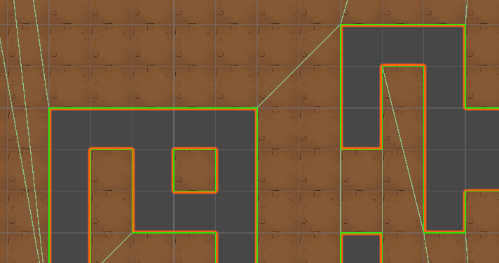

# PolygonBuilder

A fast, allocation-free contour extraction and polygon generation utility for 2D tile grids.  
Turns a solid tilemap into clean, simplified polygons at runtime with **zero per-polygon heap allocations**.



✅ Built and tested on Unity 6.2.10f1.

---

## Project Goals

### **Zero Runtime Allocations**
The entire pipeline avoids per-polygon heap allocations.
You provide a reusable vertex buffer, and polygons are streamed back through a callback. Unity object pooling and array renting is utilized to avoid `new` spam.

### **High Performance & Burst Compatibility**
Uses blittable data and Unity Jobs-friendly containers.  Input tiles are `byte[]`, **not `bool[]`**, because `bool` is **not blittable**, harms memory layout, and breaks Burst/Jobs compatibility. Designed to be fast, predictable, and cache-friendly.

### **Deterministic Output**
Contours are walked consistently with stable winding which is useful for networking, replay, and validation.

### **Portable & Game-Agnostic**
No game structure assumptions. Works anywhere you can supply a flattened tile grid.

---

## Constraints

- Tile coordinates must fit in **0-65535** (packed internally into 16-bit components).
- **Non-zero tiles are solid**, `0` is treated as empty.
- Caller must supply a `Vector2[]` buffer large enough for the largest polygon.
- Polygon data is only valid for the duration of the callback. Make sure to copy if you need to retain it.

---

## Dependencies

- [UniTask by Cysharp](https://github.com/Cysharp/UniTask)

---

## Usage

```csharp
Vector2[] scratchBuffer = new Vector2[256];

await PolygonBuilder.StreamPolygons(
    tileArray: tiles,
    width: width,
    height: height,
    array: scratchBuffer,
    consumer: (verts, count) =>
    {
        // verts[0..count] contains the polygon
        // Copy it here if you need to store it!
    },
    ct: cancellationToken
);
```

---

## How It Works

1. **Boundary Extraction** – Finds only edges exposed to empty space.
2. **Adjacency Map** – Builds a temporary point-to-neighbor graph.
3. **Contour Tracing** – Stitches edges into closed loops.
4. **Simplification** – Removes duplicate and collinear vertices.
5. **Streaming** – Emits each polygon using your buffer, no allocations.

---

## Design Notes

- Traversal prioritizes: **straight -> right turn -> any valid path**  
  This keeps polygons clean and consistent without expensive angle math.
- Uses integer cross product for turning decisions.
- Degenerate polygons (< 3 points) are discarded.
- Built to be Burst-friendly, low-overhead, and allocation-free.

---

## Common Use Cases

- Procedural or destructible tile-based worlds
- Runtime collider generation
- Dynamic terrain carving
- Reducing thousands of tile colliders into clean polygon boundaries
- Simulation or networking systems that require deterministic geometry

